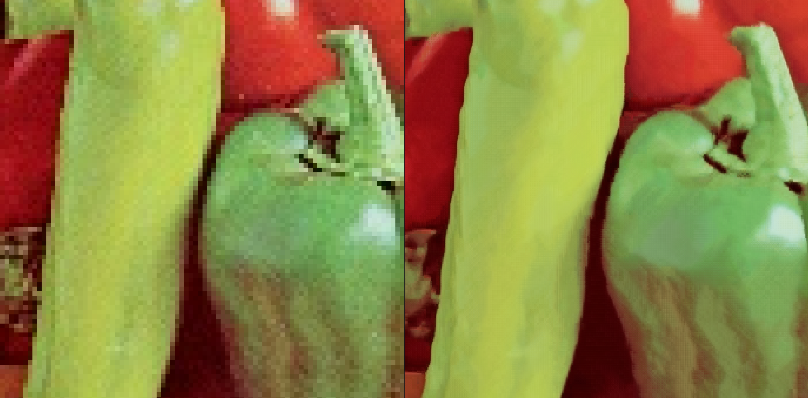
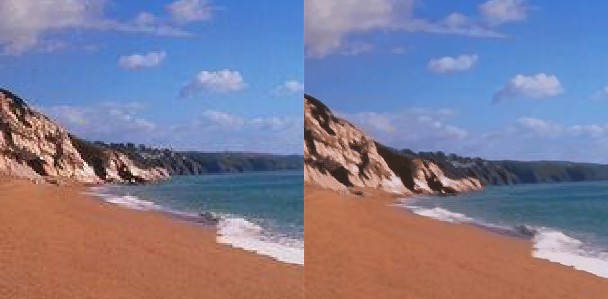
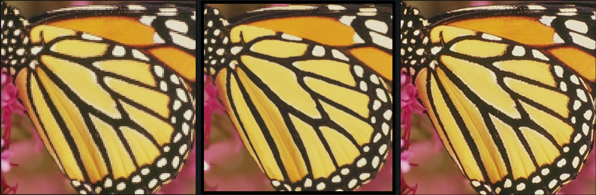
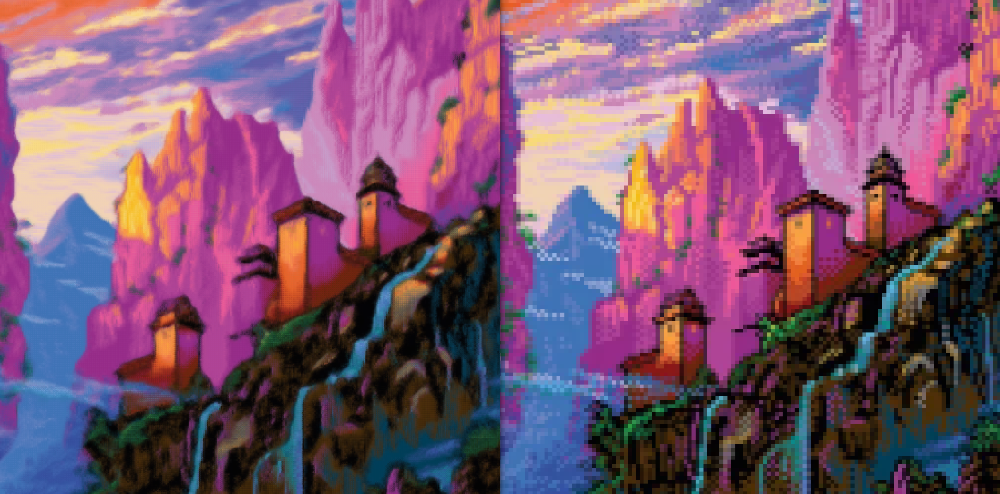

# knn-upscaler (and denoiser)

An upscaler that employs the k-nearest-neighbor method by assuming the presence of similar structures in images across various scales. Additionally, it can reduce noise and compression artifacts. However, it should be noted that this approach has limited practical significance in the era of Deep Learning super resolution, and is mainly intended for entertainment purposes.

Here are some example comparisons:

  
  
lowres - upscaled - original:  

The upscaling process is very dependent on the parameters,
with the correct ones it can also be used to upscale pixel arts (left is the upscaled):

It also works pretty well on generated images:  

## How it works

1. The algorithm scales the image down  
2. Then it iterates over each pixel and looks for a similar image patch (parameter -c for context pixels around the center pixel) in the scaled down version.  
3. For the k best image patches, it takes the corresponding 4 pixels of the center pixel in the original image and calculates their average. These 4 pixels are now the resulting pixels in the upscaled version.  

For this reason, the complexity is O(n²) (n = number of pixels), which is very bad for image upscaling.  
Therefore, the upscaler has some parameters to speed it up, sometimes at the expense of quality. For this, it will not compare patches if the center pixel distance is already over a given threshold (--stop) and assumes that similar structures are more likely to be found in the same area of the image (--area-size).
